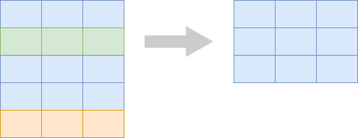
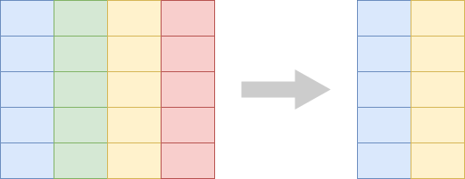

```{r setup, include=FALSE, echo=FALSE}
options(htmltools.dir.version = FALSE)
knitr::opts_chunk$set(comment = "")

library(tidyverse)
library(palmerpenguins)
# ggplot2 settings so plots scale well for slide size 
theme_set(theme_gray(18))
update_geom_defaults("point", list(size = 2.5))
```


# Elementary data manipulations

This class:

- Pick rows
- Pick columns
- Sort rows

<br>

--

Next class:

- Make new columns
- Count

---
class: center, middle

# But first: the pipe operator `%>%`

---
class: center, middle

# `%>%` is pronounced "and then"

---

# The pipe `%>%` feeds data into functions

.small-font[
```{r}
head(penguins)
```
]

---

# The pipe `%>%` feeds data into functions

.small-font[
```{r}
# head(penguins)

penguins %>%
  head()
```
]


---

# The pipe `%>%` feeds data into functions

.tiny-font[
```{r warning=FALSE, fig.height=5}
ggplot(penguins, aes(bill_length_mm, bill_depth_mm, color = species)) + geom_point()
```
]

---

# The pipe `%>%` feeds data into functions

.tiny-font[
```{r warning=FALSE, fig.height=5}
# ggplot(penguins, aes(bill_length_mm, bill_depth_mm, color = species)) + geom_point()

penguins %>%
  ggplot(aes(bill_length_mm, bill_depth_mm, color = species)) + geom_point()
```
]

---

# Pick rows from a table: `filter()`

<br>

.center[
</img>
]


---

# Filter out penguins of species Gentoo

.small-font[
```{r}
penguins %>%
  filter(species == "Gentoo")
```
]

---

# Filter out penguins with bill length > 50 mm

.small-font[
```{r}
penguins %>%
  filter(bill_length_mm > 50)
```
]

---

# Pick columns from a table: `select()`

<br>

.center[
</img>
]


---

# Pick columns `species`, `island`, and `sex`

.small-font[
```{r}
penguins %>%
  select(species, island, sex)
```
]

---

# Sort the rows in a table: `arrange()`

<br>

.center[
</img>
]

---

# Sort penguins by bill length, ascending

.small-font[
```{r}
penguins %>%
  arrange(bill_length_mm)
```
]

---

# Sort penguins by bill length, descending

.small-font[
```{r}
penguins %>%
  arrange(desc(bill_length_mm))
```
]

