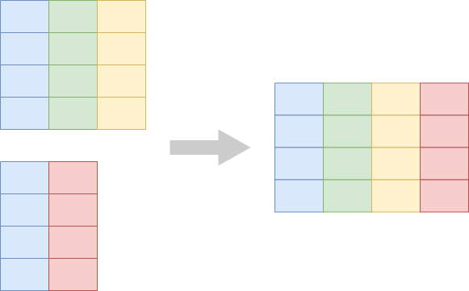
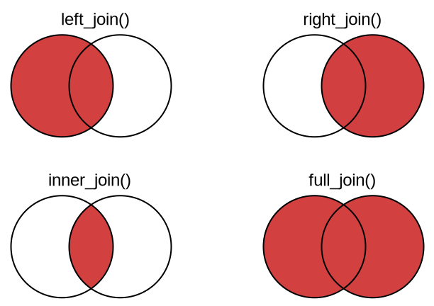

```{r setup, include=FALSE, echo=FALSE}
options(htmltools.dir.version = FALSE)
knitr::opts_chunk$set(comment = "")

library(tidyverse)
library(palmerpenguins)
```


## Elementary data manipulations

.pull-left[
Previous class:

- Pick rows: `filter()`
- Pick columns: `select()`
- Sort rows: `arrange()`
- Count things: `count()`
- Make new columns: `mutate()`
]

---

## Elementary data manipulations

.pull-left[
Previous class:

- Pick rows: `filter()`
- Pick columns: `select()`
- Sort rows: `arrange()`
- Count things: `count()`
- Make new columns: `mutate()`
]

.pull-right[
This class:

- Analyze subsets:<br>`group_by()` and `summarize()`
]

---

## Elementary data manipulations

.pull-left[
Previous class:

- Pick rows: `filter()`
- Pick columns: `select()`
- Sort rows: `arrange()`
- Count things: `count()`
- Make new columns: `mutate()`
]

.pull-right[
This class:

- Analyze subsets:<br>`group_by()` and `summarize()`
- Reshape:<br>`pivot_wider()`, `pivot_longer()`
]

---

## Elementary data manipulations

.pull-left[
Previous class:

- Pick rows: `filter()`
- Pick columns: `select()`
- Sort rows: `arrange()`
- Count things: `count()`
- Make new columns: `mutate()`
]

.pull-right[
This class:

- Analyze subsets:<br>`group_by()` and `summarize()`
- Reshape:<br>`pivot_wider()`, `pivot_longer()`
- Combine datasets:<br>`left_join()`, `inner_join()`, `...`
]

---

## Analyze subsets: `group_by()` and `summarize()`

<br>

.center[
</img>
]

---

## Example application of grouping: Counting

Previously, we counted like so:

.tiny-font[

```{r eval = FALSE}
penguins %>%
  count(species)
```

```{r echo = FALSE}
# for some reason this data frame has row names, which are indicated with
# an asterisk, which shows up as a highlighted row
x <- penguins %>%
  count(species)

row.names(x) <- NULL
x
```
]

--

Now let's do it the hard way


---

## Example application of grouping: Counting

Let's go back to the raw data:

.tiny-font[

```{r}
penguins
```
]


---

## Example application of grouping: Counting

Let's group it:

.tiny-font[

```{r}
penguins %>%
  group_by(species)
```
]


---

## Example application of grouping: Counting

And summarize:

.tiny-font[

```{r eval = FALSE}
penguins %>%
  group_by(species) %>%
  summarize(
    n = n()  # n() returns the number of observations per group
  )
```

```{r echo = FALSE}
# remove row names
x <- penguins %>%
  group_by(species) %>%
  summarize(
    n = n()
  )

row.names(x) <- NULL
x
```

]


---

## Example application of grouping: Counting

Now let's group by multiple variables:

.tiny-font[

```{r}
penguins %>%
  group_by(species, island)
```
]

---

## Example application of grouping: Counting

And summarize:

.tiny-font[

```{r}
penguins %>%
  group_by(species, island) %>%
  summarize(
    n = n()  # n() returns the number of observations per group
  )
```

]


---

## Example application of grouping: Counting

`count(...)` is a short-cut for `group_by(...) %>% summarize(n = n())`

--

.tiny-font.pull-left[

```{r eval = FALSE}
penguins %>%
  count(species)
```

```{r echo = FALSE}
# remove row names
x <- penguins %>%
  count(species)

row.names(x) <- NULL
x
```

]

--

.tiny-font.pull-right[

```{r eval = FALSE}
penguins %>%
  group_by(species) %>%
  summarize(
    n = n()
  )
```

```{r echo = FALSE}
# remove row names
x <- penguins %>%
  group_by(species) %>%
  summarize(
    n = n()
  )

row.names(x) <- NULL
x
```

]

--

The output is exactly the same

---

## Performing multiple summaries at once

--

.tiny-font[

```{r eval = FALSE}
penguins %>%
  group_by(species) %>%
  summarize(
    n = n(),                                      # number of penguins
    mean_mass = mean(body_mass_g),                # mean body mass
    max_flipper_length = max(flipper_length_mm),  # max flipper length
    percent_female = sum(sex == "female")/n()     # percent of female penguins
  )
```
]

--

.tiny-font[

```{r echo = FALSE}
# remove row names
x <- penguins %>%
  group_by(species) %>%
  summarize(
    n = n(),                                      # number of penguins
    mean_mass = mean(body_mass_g),                # mean body mass
    max_flipper_length = max(flipper_length_mm),  # max flipper length
    percent_female = sum(sex == "female")/n()     # percent of female penguins
  )

row.names(x) <- NULL
x
```

]

--

Each statement in `summarize()` creates one new column

--

But why all the `NA`s?

---

## Performing multiple summaries at once

.tiny-font[

```{r eval = FALSE}
penguins %>%
  group_by(species) %>%
  summarize(
    n = n(),
    mean_mass = mean(body_mass_g, na.rm = TRUE),
    max_flipper_length = max(flipper_length_mm, na.rm = TRUE),
    percent_female = sum(sex == "female", na.rm = TRUE)/sum(!is.na(sex))
  )
```
]

.tiny-font[

```{r echo = FALSE}
# remove row names
x <- penguins %>%
  group_by(species) %>%
  summarize(
    n = n(),
    mean_mass = mean(body_mass_g, na.rm = TRUE),
    max_flipper_length = max(flipper_length_mm, na.rm = TRUE),
    percent_female = sum(sex == "female", na.rm = TRUE)/sum(!is.na(sex))
  )

row.names(x) <- NULL
x
```

]

We typically need to tell R how exactly `NA`s should be handled

[//]: # "segment ends here"

---
class: center middle

## Reshaping: Making tables wider or longer

---

## Reshape: `pivot_wider()` and `pivot_longer()`

<br>

.center[
</img>
]


---

## Reshaping example: Making a wide summary table


.tiny-font[

```{r}
penguins %>%
  count(species, island)
```
]

---

## Reshaping example: Making a wide summary table

.tiny-font[

```{r}
penguins %>%
  count(species, island) %>%
  pivot_wider(names_from = "island", values_from = "n")
```
]

The `NA`s indicate cases that don't exist

---

## And going back to long format

.tiny-font[

```{r}
penguins_wide <- penguins %>%
  count(species, island) %>%
  pivot_wider(names_from = "island", values_from = "n")

penguins_wide %>% 
  pivot_longer(cols = -species, names_to = "island", values_to = "n")
```
]


---

## And going back to long format

Column specifications work just like in `select()`:

.tiny-font[

```{r}
# specify columns by subtraction
penguins_wide %>% 
  pivot_longer(cols = -species, names_to = "island", values_to = "n")
```
]


---

## And going back to long format

Column specifications work just like in `select()`:

.tiny-font[

```{r}
# specify columns by explicit listing
penguins_wide %>% 
  pivot_longer(cols = c(Biscoe, Dream, Torgersen), names_to = "island", values_to = "n")
```

]

---

## And going back to long format

Column specifications work just like in `select()`:

.tiny-font[

```{r}
# specify columns by range
penguins_wide %>% 
  pivot_longer(cols = Biscoe:Torgersen, names_to = "island", values_to = "n")
```

]

[//]: # "segment ends here"

---
class: center middle

## Combining datasets: joins


---

## We use joins to add columns from one table into another

.center[
</img>
]


---

## Example: band members and their instruments

.tiny-font.pull-left[
```{r}
# some members of famous bands
band_members
```
]

--

.tiny-font.pull-right[
```{r}
# instruments played by some band members
band_instruments
```
]

--

.tiny-font[
```{r}
left_join(band_members, band_instruments) # add right table to left
```
]

---

## Example: band members and their instruments

.tiny-font.pull-left[
```{r}
# some members of famous bands
band_members
```
]

.tiny-font.pull-right[
```{r}
# instruments played by some band members
band_instruments
```
]

.tiny-font[
```{r}
right_join(band_members, band_instruments) # add left table to right
```
]


---

## Example: band members and their instruments

.tiny-font.pull-left[
```{r}
# some members of famous bands
band_members
```
]

.tiny-font.pull-right[
```{r}
# instruments played by some band members
band_instruments
```
]

.tiny-font[
```{r}
inner_join(band_members, band_instruments) # keep intersection only
```
]


---

## Example: band members and their instruments

.tiny-font.pull-left[
```{r}
# some members of famous bands
band_members
```
]

.tiny-font.pull-right[
```{r}
# instruments played by some band members
band_instruments
```
]

.tiny-font[
```{r}
full_join(band_members, band_instruments) # merge all cases
```
]


---

## The different joins at a glance

.center[
</img>
]


---

## The different joins at a glance

</img>

<br>

**Tip:** In case of doubt, use `left_join()`

--

In my experience, `left_join()` is the right choice  
70–80% of the time

[//]: # "segment ends here"

---

## Further reading

- R for Data Science: [Chapter 5.6: Grouped summaries with `summarise()`](https://r4ds.had.co.nz/transform.html?q=group_by#grouped-summaries-with-summarise)
- R for Data Science: [Chapter 12.3: Pivoting](https://r4ds.had.co.nz/tidy-data.html?q=pivot#pivoting)
- R for Data Science: [Chapter 13: Relational data](https://r4ds.had.co.nz/relational-data.html)
- **dplyr** documentation: [Grouped data](https://dplyr.tidyverse.org/articles/grouping.html)
- **tidyr** documentation: [Pivoting](https://tidyr.tidyverse.org/articles/pivot.html)
- **dplyr** documentation: [Mutating joins](https://dplyr.tidyverse.org/articles/two-table.html#mutating-joins-1)
