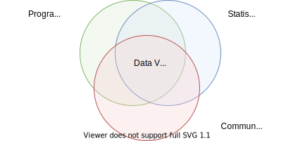
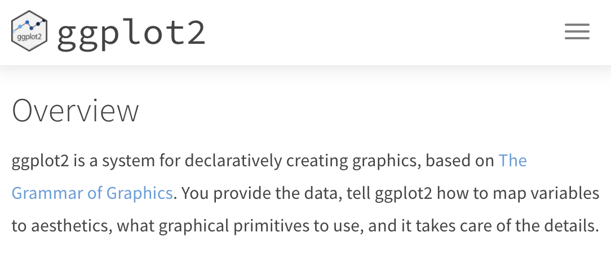
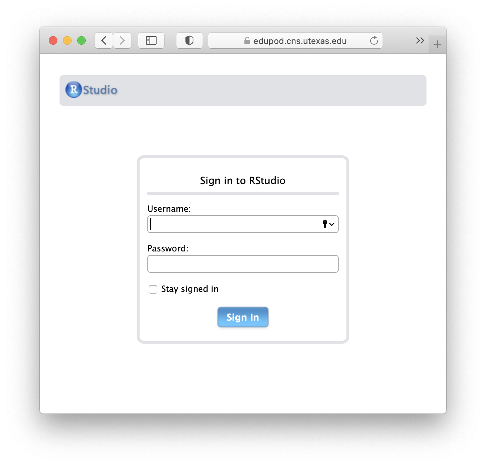
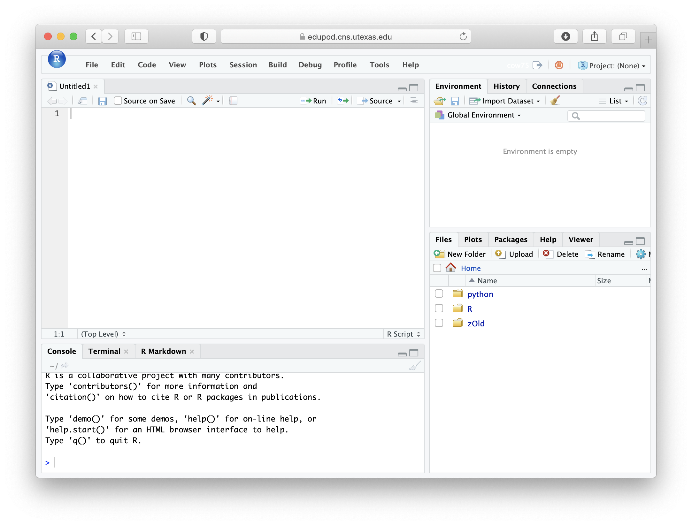
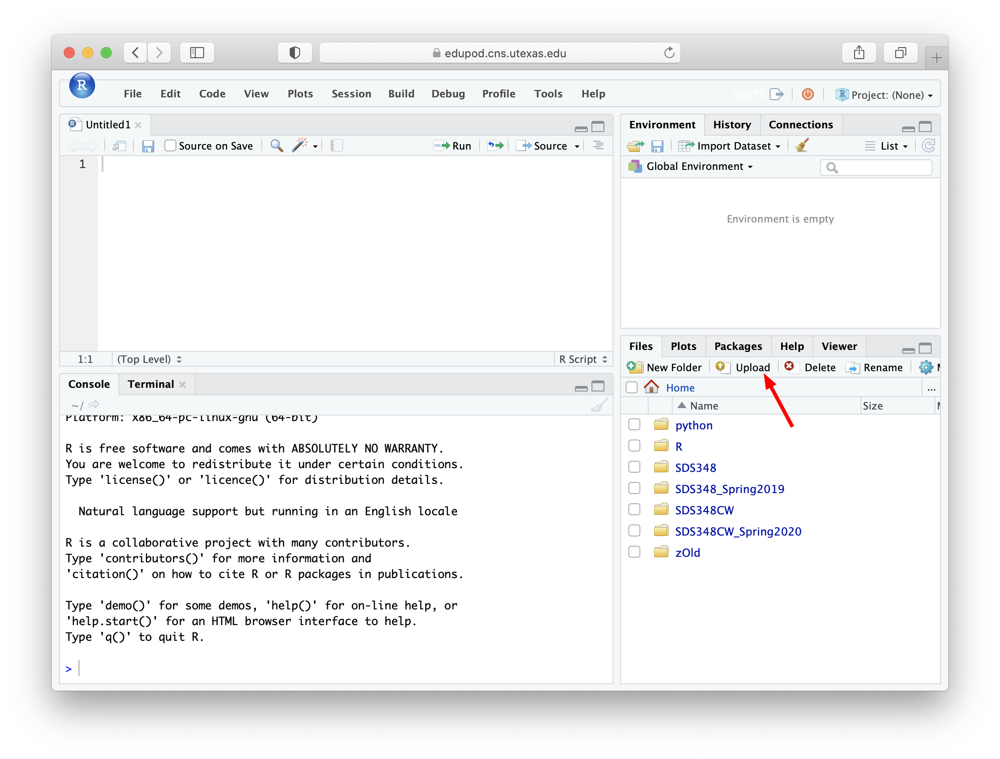
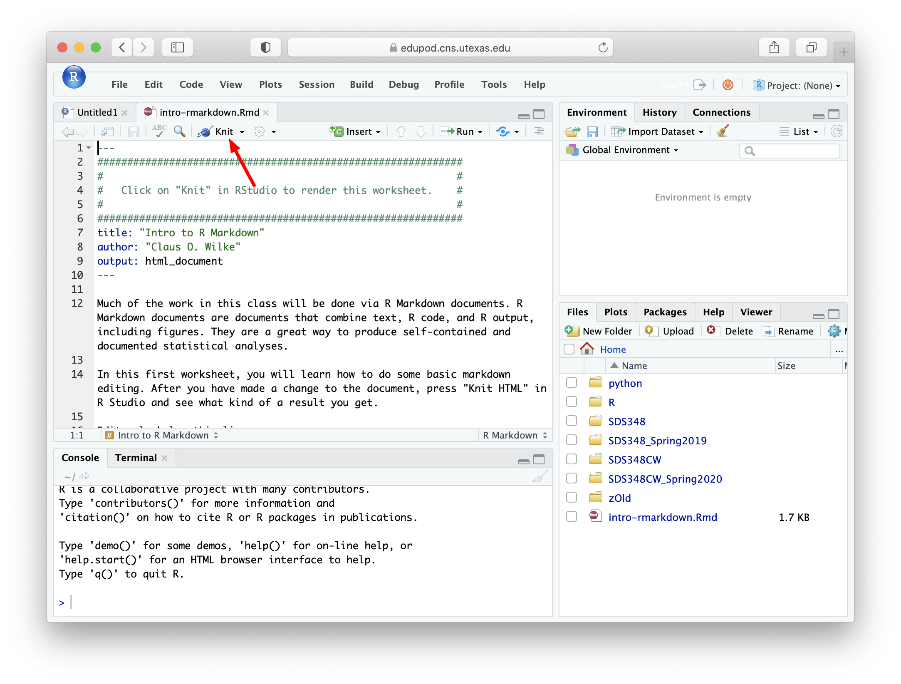
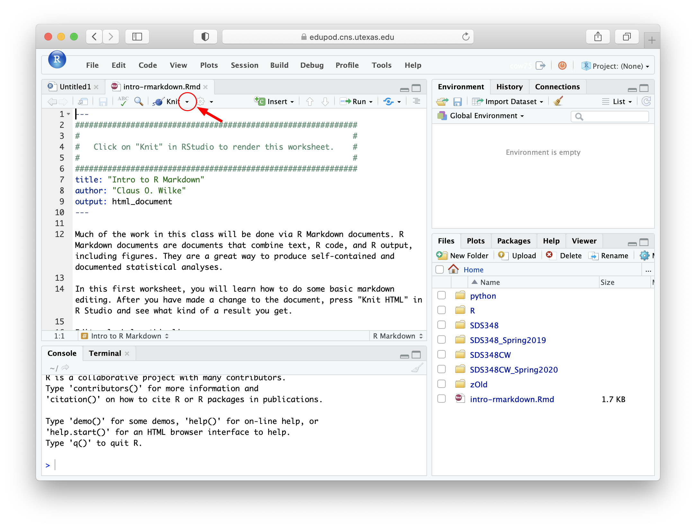
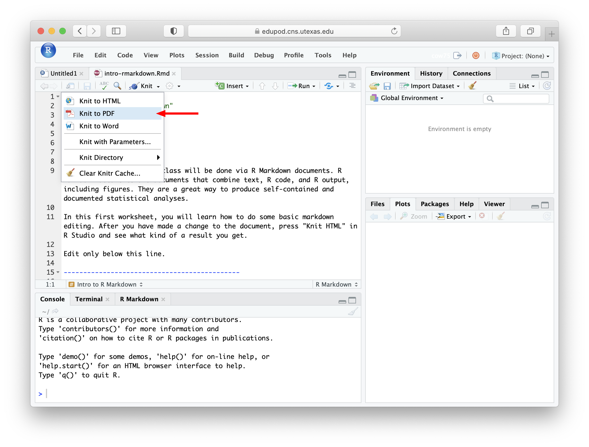
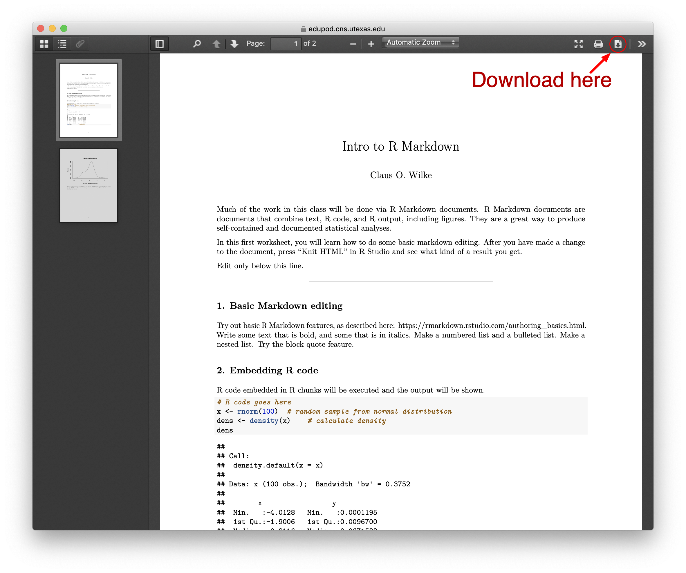

```{r setup, include=FALSE, echo=FALSE}
options(htmltools.dir.version = FALSE)
knitr::opts_chunk$set(comment = "")
```

## Why Data Visualization?

--

<br>

.center[
</img>
]

---


## Why Data Visualization?

<br>

.center[
</img>
]


---

## Why R?

--

</img>

</img>

???

The R logo [is distributed](https://www.r-project.org/logo/) under the terms of the Creative Commons Attribution-ShareAlike 4.0 International license ([CC-BY-SA 4.0](https://creativecommons.org/licenses/by-sa/4.0/)).

RStudio hex stickers [are distributed](https://github.com/rstudio/hex-stickers) under [CC0.](https://github.com/rstudio/hex-stickers/blob/master/LICENSE.md)

--

</img>
---

## Why me?

--

</img>

<br><br><br><br><br><br><br><br><br><br><br><br><br><br>

.pull-left.small-font[

.center[
https://clauswilke.com/dataviz
]

]


--

</img>

--

</img>


--

</img>

--

</img>

--

</img>

---

## Why me?

.center[
</img>
]

--

.center[
</img>
]

[//]: # "segment ends here"

---
class: middle

## Class website/syllabus: https://wilkelab.org/SDS375

---

## The first core concept: Markdown

--

**Input:**

.small-font[
```
This is a sentence in Markdown, containing `code`, **bold text**,
and *italics*.
```
]


--

**Output:**

.small-font[
This is a sentence in Markdown, containing `code`, **bold text**, and *italics*.
]

---

## The first core concept: Markdown

.pull-left[
**Input:**

.small-font[
```
## 1 Introduction

Data visualization is part art 
and part science. The challenge 
is to get the art right without
getting the science wrong and 
vice versa.
```
]]


.pull-right[
**Output:**

## 1 Introduction

Data visualization is part art 
and part science. The challenge 
is to get the art right without
getting the science wrong and 
vice versa.

]


.absolute-bottom-right[
Text taken from: C. O. Wilke, [Fundamentals of Data Visualization](https://clauswilke.com/dataviz/introduction.html)
]

---

## R Markdown combines Markdown and R code

--

**Input:**

.small-font[

````
The function `rnorm()` creates normal variates.
`r ''````{R}
rnorm(5) # create 5 normal variates
```
````
]

--

**Output:**

.small-font[

The function `rnorm()` creates normal variates.
```{R}
rnorm(5) # create 5 normal variates
```
]

[//]: # "segment ends here"

---
class: middle

## Running R: R, RStudio, and edupod

---

## Edupod login: https://edupod.cns.utexas.edu

.center[
</img>
]

---

## Edupod login: https://edupod.cns.utexas.edu

.center[
</img>
]

---

## Edupod login: https://edupod.cns.utexas.edu

.center[
</img>
]

---

## Using RStudio

.center[
</img>
]

---

## Using RStudio

.center[
</img>
]

---

## Knitting an R Markdown file

.center[
</img>
]

---

## Knitting an R Markdown file

.center[
</img>
]

---


## Knitting an R Markdown file

.center[
</img>
]

---

## Knitting to pdf

.center[
</img>
]

---

## Knitting to pdf

.center[
</img>
]

---

## Knitting to pdf

.center[
</img>
]

---

## Knitting to pdf

.center[
</img>
]

---

## Further reading

- [R Markdown tutorial](https://rmarkdown.rstudio.com/lesson-2.html)
- [R Markdown cheatsheet](https://github.com/rstudio/cheatsheets/raw/main/rmarkdown.pdf)
- [R Markdown book](https://bookdown.org/yihui/rmarkdown/)
