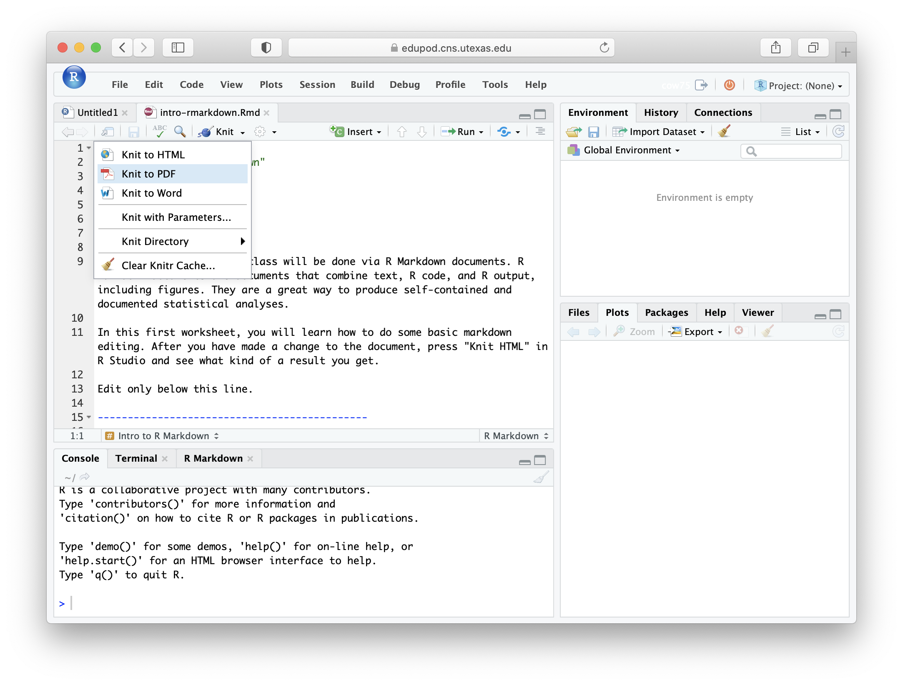

```{r setup, include=FALSE, echo=FALSE}
options(htmltools.dir.version = FALSE)
knitr::opts_chunk$set(comment = "")
```


### Edupod login: https://edupod.cns.utexas.edu

.center[
</img>
]

---

### Edupod login: https://edupod.cns.utexas.edu

.center[
</img>
]

---

### Using RStudio

.center[
</img>
]

---

### Using RStudio

.center[
</img>
]

---


### Using RStudio

.center[
</img>
]

---

### Knitting to pdf

.center[
</img>
]

---

### Knitting to pdf

.center[
</img>
]

---